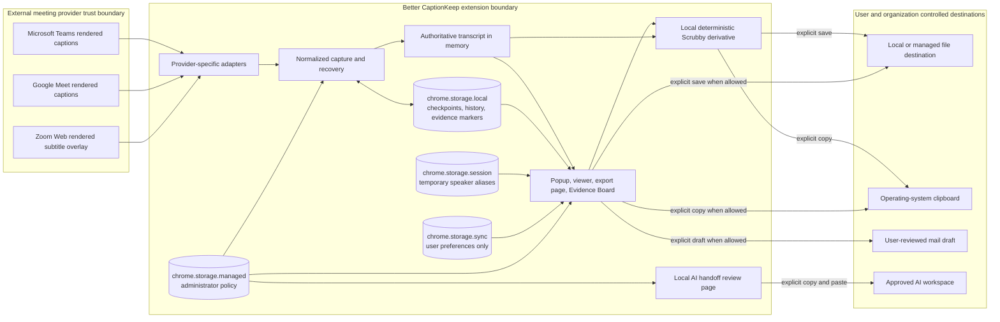
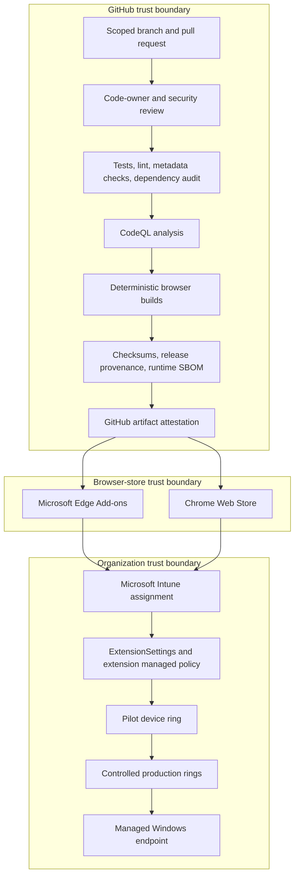

# Better CaptionKeep security architecture

Status: review candidate

Applies to: Better CaptionKeep 5.2 development line

Last reviewed: September 26, 2026

Owners: Product Owner, Extension Engineering, Endpoint Engineering, Security Architecture

## Purpose

This document describes how Better CaptionKeep captures, stores, transforms, and releases meeting-caption data. It is the primary security-architecture reference for source review, enterprise pilot approval, managed deployment, incident response, and future design changes.

Better CaptionKeep is a Manifest V3 Chromium extension. Its supported baseline is local-first: it reads captions already rendered in a supported meeting page, normalizes them in the browser, and stores or exports them only through extension and user actions. No developer-operated transcript service is required.

This document is design evidence, not a certification. An adopting organization remains responsible for meeting-consent rules, records classification, endpoint protection, DLP, retention, approved AI use, and legal or regulatory decisions.

## Security objectives

1. Request only the browser and host permissions required for caption capture and local product features.
2. Keep meeting text out of developer infrastructure, telemetry, navigation URLs, and remote code paths.
3. Preserve the captured transcript as the authoritative local source while treating cleaned output, evidence markers, summaries, and notes as derivatives.
4. Require an explicit user action before data crosses into a file, clipboard, email draft, or AI workspace.
5. Allow administrators to reduce available release paths and retention through read-only managed browser policy.
6. Bind distributed packages to a reviewed source revision using tests, checksums, provenance, an SBOM, and Store identity.
7. Make capture gaps, provider limitations, and residual privacy risks visible rather than implying completeness or compliance.

## Runtime trust and data flow

The arrows to files, clipboard, mail, and AI are controlled release points. Managed policy is checked in the UI and again at the service-worker enforcement boundary for history, transcript export, and AI handoff. UI disabling alone is not treated as a security control.

### Runtime components

| Component | Responsibility | Security boundary |
| --- | --- | --- |
| Provider registry and adapters | Match exact supported meeting hosts and interpret provider DOM | Provider selectors remain isolated from shared services |
| Capture coordinator and Teams capture lane | Normalize caption records, expose health, maintain bounded recovery | Does not capture microphone, video, WebSocket traffic, or arbitrary pages |
| Service worker | Enforce history, export, AI-handoff, filename, and job-lifetime controls | Rechecks managed policy before protected actions |
| Session manager | Chunk, index, validate, retain, and delete local transcript history | Managed maximum and retention are enforced on write and service-worker lifecycle |
| Scrubby | Create a deterministic cleaned derivative | Never overwrites the authoritative transcript; false negatives and positives remain possible |
| Evidence Board | Store user-created markers and notes tied to source-caption identifiers | Markers are derivatives and cannot rewrite the transcript |
| Export page | Stage and complete local downloads | Rejects and removes pending export jobs when file export is administratively disabled |
| AI handoff page | Present a local review buffer and approved destination links | No automatic paste, upload, API call, or transcript-bearing provider URL |

## Enterprise control plane

Store-distributed packages retain the Store signing identity and update channel. An organization must not unpack, modify, and redeploy a Store package under the Store identity. A separately signed private build is a different product identity and requires its own key custody, update service, validation, and incident process.

## Data inventory and classification

The suggested classifications below are defaults. The adopting organization must map them to its own taxonomy.

| Data | Example fields | Location | Default sensitivity | Retention and release |
| --- | --- | --- | --- | --- |
| Active transcript | speaker, caption text, timestamp, stable key | Page memory and bounded recovery checkpoint in `storage.local` | Confidential; may become Restricted based on meeting content | Recovery is bounded to the same recent meeting page; release only through approved local actions |
| Saved session | transcript chunks, title, preview, speakers, optional attendees | `storage.local` | Confidential or Restricted | Default maximum ten; managed maximum 1–10 and retention 1–365 days; user deletion available |
| Attendee data | name, role, join/leave observations | Memory, optional session history/export | Personal and Confidential | Can be disabled by managed policy; not available on every provider |
| Evidence markers | caption snapshot, source key, category, user note | `storage.local` | Same classification as source meeting | Maximum 500 markers; explicit copy, file, or mail-draft action |
| User preferences | formats, theme, filenames, AI destinations, masking terms | `storage.sync` | Internal; custom terms may reveal organizational vocabulary | Subject to browser-account sync behavior; no transcript history is included |
| Managed policy | administrative restrictions and approved destinations | `storage.managed` and browser policy registry | Internal configuration | Administrator controlled and read-only to the user |
| Temporary aliases | speaker aliases | `storage.session` | Personal/Internal | Browser session lifetime |
| Export and handoff jobs | staged file content or AI prompt | `storage.local`, then extension-page memory | Same as source transcript | Temporary; removed after load/completion or by cleanup; blocked jobs are discarded |
| Diagnostic logs | counts, state, errors | Browser developer console | Internal; errors can still reveal context | Production logs avoid transcript and attendee-list values; redact before sharing |

### Storage-security statement

Better CaptionKeep does not add application-level encryption to extension storage. Security at rest depends on the managed browser profile, Windows account boundary, BitLocker or equivalent full-disk encryption, endpoint health, browser hardening, and administrative access controls. Exported files, clipboard history, synchronized folders, backups, mail systems, and AI workspaces are separate control domains.

## Permission justification

| Permission or host | Required use | Constraint |
| --- | --- | --- |
| `storage` | Local history, recovery, settings, managed policy, temporary jobs | No developer backend; preferences only in sync storage |
| `downloads` | Explicit TXT, Markdown, and evidence exports | Managed policy can disable file export; filenames are normalized |
| `activeTab` | Popup interaction with the active supported meeting tab | Does not provide persistent arbitrary-site access |
| `sidePanel` | Local Evidence Board | Data remains within extension storage until an explicit release action |
| Teams hosts | Read displayed captions and optional attendee DOM | Exact Microsoft hosts only |
| `meet.google.com` | Read displayed captions | Exact host only |
| `app.zoom.us` | Read tested Web-client subtitle overlay in the matching frame | No vanity-domain wildcard; no native client, audio, or video |

The extension does not request cookies, browsing history, microphone, camera, geolocation, native messaging, web request interception, or broad `<all_urls>` access.

## Managed security controls

Managed values override user settings and are defined in `teams-captions-saver/managed-schema.json`.

| Policy | Effect |
| --- | --- |
| `forcePrivacyScrubber` | Keeps Scrubby enabled in managed UI paths |
| `forceScrubbedExport` | Re-scrubs transcript, attendee, and Evidence Board release data at enforcement points |
| `forceProfanityFilter` | Adds the local profanity rule to Scrubby |
| `customScrubTerms` | Adds up to 100 administrator-selected terms to local masking |
| `disableAiHandoff` | Prevents creation or use of the AI handoff path |
| `allowedAiProviders` | Restricts enabled AI destinations |
| Managed workspace URLs | Locks approved ChatGPT or Claude HTTPS destinations to official provider hosts |
| `disableClipboard` | Blocks transcript, handoff, viewer, and Evidence Board clipboard actions |
| `disableFileExport` | Blocks transcript and Evidence Board downloads and discards pending export jobs |
| `disableEvidenceEmail` | Blocks creation of an Evidence Board mail draft |
| `disableAttendeeCapture` | Stops Teams attendee collection and locks related user controls off |
| `disableSessionHistory` | Prevents completed-session history and clears existing indexed session history |
| `maxStoredSessions` | Limits completed-session history to 1–10 sessions |
| `sessionRetentionDays` | Removes completed sessions older than 1–365 days during policy enforcement and writes |

`disableSessionHistory` does not disable short-lived crash/reload recovery checkpoints. A future policy may control recovery persistence separately if an adopting organization determines that resilience cannot be accepted for its data class.

These are controls over Better CaptionKeep-provided workflows, not a universal browser or operating-system DLP boundary. They do not prevent a user with sufficient endpoint access from using developer tools, browser accessibility features, screenshots, or other software to reproduce visible meeting content, and they cannot recall data already copied, exported, mailed, or submitted. Use managed profiles, least privilege, endpoint DLP, and approved-site controls for that threat model.

## Threat model

### Protected assets

- Meeting transcript text and speaker attribution
- Attendee identity and participation observations
- Evidence markers and user notes
- Approved AI workspace destinations and organization masking terms
- Extension signing and Store publisher identities
- Release artifacts, checksums, provenance, and source history

### Threat actors

- Malware or another user with access to the Windows profile
- A malicious or compromised extension installed in the same browser profile
- An unauthorized meeting participant or employee
- A compromised maintainer, dependency, GitHub Action, publisher credential, or Store account
- A meeting-provider DOM change that causes silent integrity loss
- An accidental user release to clipboard, file, email, personal AI workspace, or synced folder

### STRIDE analysis

| Category | Threat | Primary controls | Residual risk |
| --- | --- | --- | --- |
| Spoofing | User opens a personal AI account instead of the approved enterprise workspace | Exact official HTTPS hostname validation, managed destination URLs, explicit workspace confirmation | Provider session identity is outside extension control |
| Tampering | A package or release asset differs from reviewed source | Store identity, required validation, SHA-256 checksums, release provenance, pinned Actions, artifact attestations | Publisher or maintainer account compromise remains possible |
| Repudiation | A derivative note is presented as source transcript | Stable source-caption identifiers, immutable source/derivative distinction, provenance bundle and transcript hash | Local system time and user-authored notes are not independently notarized |
| Information disclosure | Transcript reaches clipboard, file, mail, sync, logs, or AI without authorization | Explicit actions, managed release controls, local-only profile, scrubbed-only enforcement, log minimization | Scrubby is not DLP; endpoint administrators and local malware remain in scope |
| Denial of service | Provider DOM change, storage quota, browser suspension, or policy error stops capture | Adapter isolation, capture health, bounded recovery, quota-safe writes, live UAT and rollback | Caption providers expose no stable supported transcript DOM contract |
| Elevation of privilege | Force-installed extension receives browser-granted permissions or CI action changes build output | Exact permissions, Store review, scoped workflow permissions, pinned Action SHAs, code review | Force-installed extensions cannot be disabled by ordinary users |

## Prioritized risk register

| ID | Risk | Likelihood | Impact | Level | Treatment | Owner | Status |
| --- | --- | --- | --- | --- | --- | --- | --- |
| R-01 | Sensitive transcript remains readable in the browser profile or exported file | Medium | High | High | BitLocker, managed profiles, retention policy, DLP, least-privilege local administration | Endpoint Security | Open for adopter |
| R-02 | User releases meeting content to an unauthorized clipboard, file, email, or AI destination | Medium | High | High | Hardened profile, managed release controls, approved destinations, user training, DLP | Security Architecture | Mitigated; residual accepted per deployment |
| R-03 | Provider DOM drift silently omits or misattributes captions | High | Medium | High | Provider fixtures, capture-health UI, live Chrome/Edge UAT, post-provider-change test cadence | Product Engineering | Open/continuous |
| R-04 | Supply-chain compromise changes a distributed package | Low | High | Medium | Protected branches, review, dependency audit, CodeQL, pinned Actions, checksums, SBOM, attestations, Store signing | Release Manager | Mitigated; review governance pending |
| R-05 | Browser sync exposes organizational workspace URLs or masking terms to an unintended signed-in profile | Medium | Medium | Medium | Managed values, managed browser accounts, browser-sync policy, avoid sensitive custom-term labels | Endpoint Engineering | Open for adopter |
| R-06 | Attendee observation conflicts with privacy, labor, meeting, or jurisdictional rules | Medium | High | High | Disabled in hardened profile, explicit organizational approval and notice before enabling | Privacy/Legal | Open for adopter |
| R-07 | Scrubby misses regulated or confidential content or masks harmless content | High | Medium | High | Describe as exposure reduction only, review output, DLP, prohibit unsupported compliance claims | Data Protection | Accepted limitation |
| R-08 | Maintainer bypass or zero-review repository rule permits an unreviewed production change | Medium | High | High | Require one approval, code-owner review, resolved threads, passing validation and CodeQL, audited emergency bypass | Repository Owner | Must close before enterprise GA |
| R-09 | Diagnostic output discloses meeting identity or personal information | Low | Medium | Low | Count/state-only production logs, no attendee-list or transcript logs, redact support evidence | Product Engineering | Mitigated |
| R-10 | Removal of force-install policy has an unexpected uninstall or data-retention result | Low | High | Medium | Pilot rollback test, export prohibition decision, documented browser behavior, help-desk runbook | Endpoint Engineering | Must test per tenant |

## Enterprise deployment profiles

### Standard managed profile

For organizations that permit local exports and reviewed BYOAI use. It forces Scrubby on but does not, by itself, replace DLP or constrain every release path. Administrators should explicitly choose allowed providers, destinations, retention, attendee capture, clipboard, file, and email behavior.

### Hardened local-only profile

The committed high-security profile:

- disables AI handoff;
- disables clipboard release;
- disables Evidence Board mail drafts;
- disables attendee capture;
- forces Scrubby on for release paths;
- retains at most five completed sessions for 30 days;
- permits local scrubbed file exports unless `disableFileExport` is added by the adopter.

The profile name “local-only” means the extension does not offer an AI release path. It does not mean all output is cryptographically confined to the extension; allowed local files remain governed by Windows, browser, storage, DLP, and backup controls.

## Secure development and release controls

- Pull requests run the complete release-candidate gate.
- JavaScript syntax, package contents, Store metadata, host scope, managed schema, and release provenance are checked.
- Runtime dependencies are intentionally absent; `web-ext` is a development/build dependency.
- `npm audit --audit-level=high` is part of the release-candidate gate.
- Dependabot checks npm dependencies weekly.
- CodeQL analyzes JavaScript on pull requests, protected branches, and a weekly schedule.
- Third-party workflow actions are pinned to full commit SHAs.
- Tagged releases include SHA-256 checksums, source/package provenance, a CycloneDX runtime SBOM, and a GitHub/Sigstore-backed artifact attestation.
- Release publication remains a separate controlled action; generating a candidate does not publish it to a Store.

Repository rules must require the validation and CodeQL checks plus at least one approval before this control set is represented as enterprise-GA governance. Emergency bypass must be limited, justified, and auditable.

## Windows enterprise assumptions

An enterprise approval assumes:

- supported Windows and Chromium versions;
- Intune or equivalent device-management enrollment;
- a corporate Windows account and managed browser profile;
- BitLocker or equivalent full-disk encryption;
- endpoint detection and response, antimalware, and least-privilege local administration;
- browser extension allow/block governance;
- a decision on browser preference sync;
- DLP and records controls appropriate for transcript exports, clipboard, mail, and approved AI workspaces;
- help-desk ownership and a tested removal/rollback procedure.

## Pilot acceptance criteria

Security Architecture may recommend pilot approval when all of the following are evidenced:

1. The intended meeting classes and prohibited data classes are documented.
2. Legal/Privacy approves the consent and attendee-capture position.
3. The selected managed profile is peer-reviewed and its SHA-256 recorded.
4. Store identity and update URL match the reviewed deployment record.
5. Intune assignment is limited to a named pilot group.
6. `edge://policy` or `chrome://policy` shows the expected force-install and extension managed values.
7. A synthetic meeting validates capture, recovery, scrubbed export, policy locks, deletion, and rollback without real confidential data.
8. Teams PWA/Web and Google Meet UAT pass on supported browser builds; Zoom is included only for a promoted Store version with completed live gates.
9. Endpoint encryption, DLP, browser sync, download destination, and support ownership are recorded.
10. Open high risks have an owner, deadline, compensating control, or explicit risk acceptance.

## Enterprise GA gate

Organization-wide deployment additionally requires:

- successful pilot observation through at least one browser update and normal provider UI change window;
- repository review protection with no routine single-maintainer path to production;
- verified artifact attestation and Store artifact identity;
- documented vulnerability triage and security-update service levels;
- tested staged rollout, pause, and rollback;
- a current support matrix and end-of-life policy;
- a security and privacy review after any new host permission, network destination, remote service, AI automation, or transcript data class.

## Incident response

Potential vulnerabilities, exposed credentials, or transcript/privacy failures must use the repository private vulnerability-reporting path rather than a public issue.

For a suspected product security incident:

1. Stop Store promotion and pause the affected Intune ring.
2. Preserve the reviewed commit, package hash, Store version, policy profile, and sanitized reproduction evidence.
3. Determine whether the issue affects confidentiality, transcript integrity, availability, or deployment identity.
4. If necessary, disable release paths through managed policy while preserving evidence.
5. Prepare and validate a patched candidate through the full gate.
6. Publish through the controlled Store path and enforce a safe minimum version only after availability is verified.
7. Document residual data outside the extension, including exported files, clipboard history, email, backups, and AI workspaces.

## Architectural decisions

### ADR-001: Store identity is the default enterprise distribution model

Decision: deploy the reviewed Microsoft Edge Add-ons or Chrome Web Store identity through enterprise policy.

Reason: preserves browser signing, update, identity, and removal behavior without organization-specific package-key custody.

Trade-off: the organization depends on Store review and update timing.

### ADR-002: Local-first remains the baseline

Decision: capture and core transcript services require no developer backend.

Reason: reduces central collection, authentication, availability, breach, and residency scope.

Trade-off: centralized compliance logging, server-side DLP, and organizational retention are not provided by the product.

### ADR-003: Managed policy is enforced at action boundaries

Decision: administrative restrictions are checked at UI and service-worker/export boundaries.

Reason: disabling a visible control alone is insufficient.

Trade-off: every new release path must integrate the policy layer and tests.

### ADR-004: Source transcript and derivatives remain distinct

Decision: Scrubby output, evidence markers, summaries, and user notes never rewrite the authoritative transcript.

Reason: preserves provenance and prevents an inferred or cleaned derivative from being represented as the captured source.

Trade-off: the original remains locally present until retention or deletion controls remove it.

## Revisit triggers

Security Architecture review is mandatory before:

- adding a host permission or browser permission;
- adding a developer-operated API, analytics, authentication, or telemetry;
- automating paste, submission, email sending, or recipient selection;
- capturing chat, audio, video, files, or network traffic;
- supporting a new meeting provider or wildcard domain;
- changing Store identity, signing, update source, or private-hosting model;
- claiming regulatory certification or guaranteed sensitive-data removal;
- introducing centralized enterprise storage or an enterprise AI gateway.

## Related evidence

- [Security and privacy design](SECURITY-PRIVACY.md)
- [Intune and EUC deployment](EUC-DEPLOYMENT.md)
- [Platform adapter boundary](PLATFORM-ADAPTERS.md)
- [Release process](RELEASE_PROCESS.md)
- [Enterprise security review record](ENTERPRISE-SECURITY-REVIEW.md)
- [Privacy policy](../PRIVACY.md)
- [Security policy](../SECURITY.md)

Authoritative external references:

- [Manage Microsoft Edge extensions in the enterprise](https://learn.microsoft.com/en-us/deployedge/microsoft-edge-manage-extensions)
- [Microsoft Edge ExtensionSettings reference](https://learn.microsoft.com/en-us/deployedge/microsoft-edge-manage-extensions-ref-guide)
- [Microsoft Edge force-install policy](https://learn.microsoft.com/en-us/deployedge/microsoft-edge-policies/extensioninstallforcelist)
- [Chrome Enterprise extension installation](https://support.google.com/chrome/a/answer/7649924)
- [Chrome `storage.managed` API](https://developer.chrome.com/docs/extensions/reference/api/storage#property-managed)
- [GitHub artifact attestations](https://docs.github.com/en/actions/security-guides/using-artifact-attestations-to-establish-provenance-for-builds)
