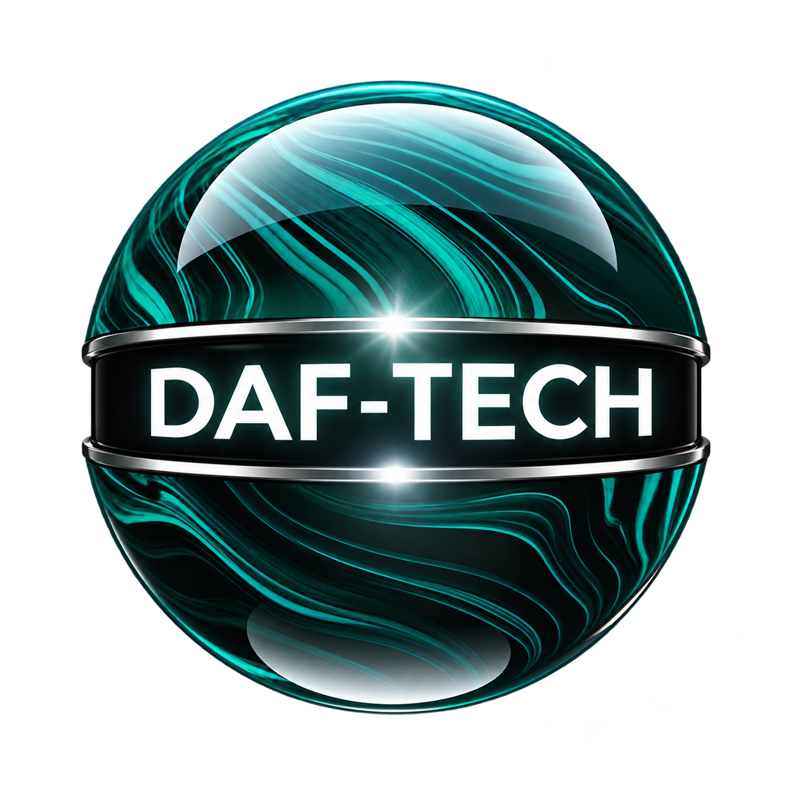
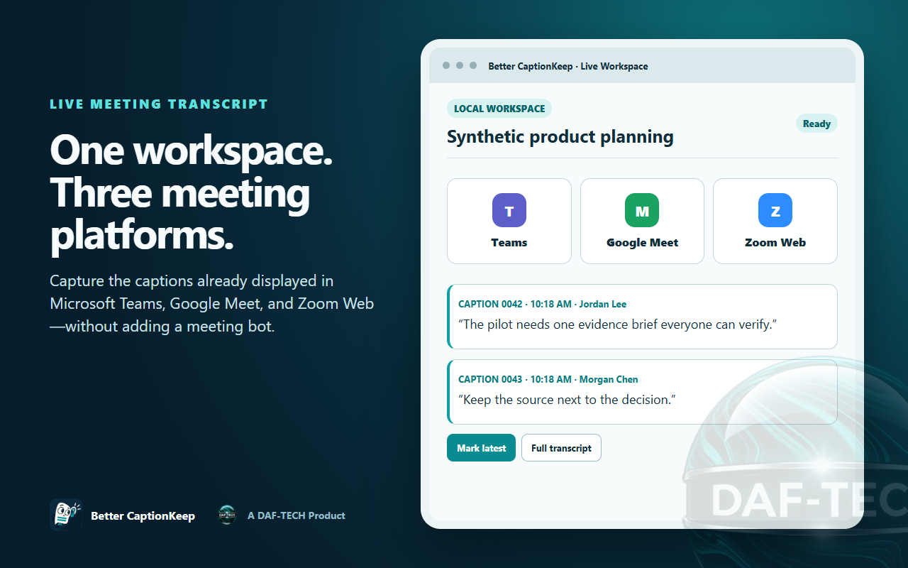
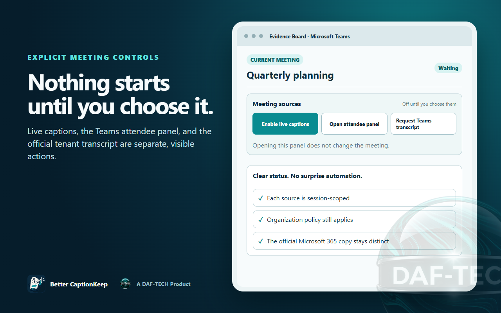

# Better CaptionKeep

**A DAF-TECH Product** — Keep the words. Stay in the conversation.

[Trust Center](docs/TRUST-CENTER.md) · [Privacy policy](PRIVACY.md) · [Report a vulnerability](SECURITY.md) · [Report an issue](https://github.com/Mr-GraphnStaff/better-captionkeep/issues) · [Contributing](CONTRIBUTING.md) · [MIT license](LICENSE)

Save live captions from Microsoft Teams, Google Meet, and Zoom Web in Chrome or Microsoft Edge, including the Teams PWA. Export TXT, Markdown, or Word documents, choose a save location, revisit the durable local completed-meeting archive, and select a synchronized interface theme. Scribble is our listening transcript mascot.

> **Current install status — October 7, 2026:** Microsoft Edge Add-ons and Chrome Web Store both publicly serve `5.3.2`. The public update services independently returned version 5.3.2 for both production identities. Version `5.3.3` is a local hotfix candidate for the popup reliability fixes described below; it has not been submitted or published. Azure Boards bug #297 remains active until existing Chrome and Edge installations upgrade from their prior public versions and the upgraded extension passes the production smoke test.

> **Development status:** Work on `5.4` began October 4, 2026 under the governed launch-mode rule. It does not alter the frozen 5.3.2 submission. Development includes one-package managed language selection and 38 interface catalogs, explicit user-controlled meeting-source actions, DAF-TECH parent branding, and refreshed Store materials. English is the reviewed source; every non-English catalog remains a clearly labeled, uncertified AI-assisted preview until a qualified reviewer approves it. Live browser and deployment validation remain open. Connected-assistant, MCP, automatic research, and connector-action experiments are excluded from this release. The [Unified AI Framework](docs/UNIFIED-AI-FRAMEWORK.md) defines the proposed zero-infrastructure provider-adapter direction; it is design work, not a shipping capability. See the [5.4 development record](docs/RELEASE-5.4.md).

### Current 5.3 capabilities

**All Settings** is a prominent full-width control beneath the popup header. It opens every setting in a full browser tab; it is also available through the browser's extension Options action. The transcript viewer has per-export file types, Print / PDF (choose Save as PDF in the browser dialog), and keyboard shortcuts. The AI handoff offers reusable local task templates without retaining transcripts as templates.

**Chat & links** captures a user-requested snapshot of loaded meeting-chat rows from recognized meeting panes. It does not capture the entire Teams chat application, scroll or fetch older messages, or guarantee full chat history. Unsupported layouts fail explicitly; provider selectors need live UAT. Reviewed extras are separate from spoken evidence and are removed with source archive deletion/retention. **Screenshot** captures only the active supported meeting tab, opens a review preview, and requires confirmation before local retention. Images are not automatically scrubbed and are blocked under forced scrubbed-export policy.

**Translate** uses the browser's feature-detected on-device Translator API, supports incremental translation of visible captions while the panel is open, and creates a separate machine-translated derivative. Language packs may need an initial download. Unsupported devices/language pairs show an explicit fallback to the reviewed AI Translate template; no cloud translation is silently substituted.

Better CaptionKeep is one product: every shipped feature is available to every user without payment, activation, subscription, or a feature tier. Organizational security policy, provider authorization, tenant consent, and browser capability requirements still apply. Google Drive/Docs and OneDrive/SharePoint transport adapters have mocked tests; end-user sign-in, provider app configuration, separate consent, preview integration, and live uploads remain unfinished. See [universal feature access](docs/FEATURE-ACCESS.md) and [competitive feature tracking](docs/COMPETITIVE-FEATURES-2026-10-03.md).

The viewer also exports SRT/WebVTT when a newly imported official Teams transcript contains real media cue boundaries. Live browser observation times and older imports without preserved boundaries are rejected rather than assigned invented timing. Use `npm run build:dev` for development and `npm run build:uat` for the one release candidate; ad hoc output folders are intentionally unsupported.

## Current product

Better CaptionKeep is a free, local-first transcript and meeting-evidence workspace for Microsoft Teams, Google Meet, and Zoom Web. It captures captions already displayed to the participant rather than recording microphone, tab, or system audio. Browser-local history, search, exports, Privacy Scrubber, Evidence Board, on-device translation where the browser supports it, and review-first AI handoff are available without an account, subscription, or publisher-operated transcript service.

Zoom Web has been a governed supported provider since the 5.1 line. Its tested subtitle overlay does not reliably expose speaker identity, so Better CaptionKeep records `Unknown speaker` instead of inventing attribution. Native Zoom desktop-client and system-audio capture are not supported.

The 5.3 line introduces **Verified Teams Transcript**: a delegated Microsoft Graph experience that recognizes the active Teams meeting, shows up to five recent eligible Teams meetings, and retrieves a chosen official transcript into the standard viewer and private local history. Live Edge validation exposed that `5.3.1` hid Microsoft 365 in the Store build even though local Dev/UAT overlays passed. Version `5.3.2` is the controlled recovery: every organization supplies its own single-tenant Entra tenant ID and client ID through local setup or managed policy; Store packages contain no shared tenant identity. The Microsoft 365 setup remains visible, validates configuration before sign-in, and rejects tokens issued by any other tenant. See the [5.3.2 recovery record](docs/RELEASE-5.3.2.md), [Graph transcript connector record](docs/GRAPH-TRANSCRIPT-CONNECTOR.md), and [customer Entra registration runbook](docs/ENTRA-GRAPH-APP-REGISTRATION.md).

The `5.3.3` hotfix candidate removes the popup's competing **View Transcript** and **Open Evidence Board** actions. One **Open Live Workspace** action now opens the side panel, where the live transcript and source-linked evidence stay together. The full transcript viewer remains available through **Open full transcript** and for completed history. The hotfix also stops intercepting `Ctrl+V` / `Cmd+V`, restoring the normal paste command. The complete Microsoft 365 transcript-import workspace now appears only in the full-tab **All Settings** page, keeping the popup compact and preventing the transient popup from closing while an administrator copies setup values. See the [5.3.3 hotfix record](docs/RELEASE-5.3.3.md).

## Release lineage

Better CaptionKeep began as a fork of the MIT-licensed Live-Captions-Saver project and is now independently developed. The [5.0 record](docs/RELEASE-5.0.md) established the shared multi-provider architecture, [5.1](docs/RELEASE-5.1.md) added governed Zoom Web support, [5.2](docs/RELEASE-5.2.md) introduced the enterprise security-review line, [5.3.2](docs/RELEASE-5.3.2.md) is the frozen Store-recovery release, and [5.4](docs/RELEASE-5.4.md) is now in Development. Historical release documents preserve what was and was not available in each artifact; they do not override the current product status above.

## 5.4 interface previews

These synthetic 5.4 release-candidate previews contain no customer meeting,
tenant, transcript, or account data. They show the current product story but
must not be confused with proof of Store approval or public availability.

| Three meeting platforms | Explicit meeting controls |
| --- | --- |
|  |  |

## What it does

- Capture displayed Teams, Google Meet, and Zoom Web captions and available speaker information; Zoom Web uses explicit `Unknown speaker` attribution when its subtitle overlay does not expose a name.
- Export TXT or Markdown with a choice of save location.
- Automatically archive completed meetings locally, reopen them after browser restart, and use speaker aliases. Search the full retained archive by keyword or phrase with meeting-title, speaker, date, and ordering filters, then jump to the matching source caption. The archive does not silently evict older meetings; explicit user deletion and managed retention remain available.
- Optionally include attendee information or hand a transcript to an AI provider.
- Choose CaptionKeep, Light, Midnight, or Follow system appearance across every extension page.
- Work in a branded transcript viewer with a sticky search, speaker-filter, copy, save, and history toolbar.
- Keep the popup calm with expandable settings sections; everyday capture controls remain visible first.
- Open Teams, Zoom Web, or Google Meet from a compact app row, with separate quick-start actions directly below for Meet now or a new meeting.
- Recover an interrupted Google Meet capture from a recent local checkpoint for the same meeting page, then commit it to local history once the meeting ends.
- See capture health in the popup, including the number of caption lines and how recently the last caption arrived.
- Prepare evidence-backed meeting notes with caption IDs for decisions, actions, risks, and unanswered questions before any optional AI handoff.
- Open a slim Chrome or Edge Evidence Board beside the meeting, search the captured transcript, and mark any caption as a decision, action item, question, risk, follow-up, or important moment. Markers stay local, retain their source caption ID, and export as Markdown or provenance JSON without modifying the raw transcript. A reviewed email action opens the user's mail composer without choosing recipients or sending automatically.
- Export/import user preferences or let administrators enforce selected controls through managed browser policy.
- Choose a browser-following or explicit interface language from 38 packaged catalogs. Non-English choices are visibly labeled as uncertified AI-assisted previews and fall back to English; administrators can lock the choice with `forceUiLocale`.
- Open a focused, plain-language GitHub form for a bug, feature idea, or language correction. The forms warn users not to include transcript text, participant details, meeting links, tenant identifiers, or other private meeting data.
- When enabled by an organization, find the current or five recent Teams meetings and explicitly import an authorized official transcript with a separate raw source and verifiable local provenance.
- Choose meeting sources from the Live Workspace side panel. Live captions are never enabled merely because Better CaptionKeep opens; Teams attendee capture and Microsoft 365 transcription each require their own visible user action. The interface distinguishes the local browser copy from the official tenant-retained transcript and reports when role, meeting state, or tenant policy prevents an action.

Better CaptionKeep is BYOAI today: it prepares short local instructions plus a complete, coverage-checked Markdown evidence file and bounded numbered copy chunks. You review the selected privacy mode, included/omitted counts, chunk count, and file size before deciding whether anything leaves the extension. Privacy Scrubber is visible and on by default: it masks supported sensitive patterns consistently across the complete handoff, leaves the saved original unchanged, and requires a second confirmation before unmasked material can be copied. Pattern detection reduces accidental disclosure risk but does not guarantee HIPAA, PCI DSS, or other regulatory compliance. For managed ChatGPT or Claude accounts, first open the approved enterprise workspace and copy its URL into **Settings → Enterprise destinations**. Better CaptionKeep accepts only official HTTPS provider domains, never places transcript text in a provider URL, and asks you to confirm the active workspace before attaching or pasting. Preferences, including enterprise destinations and the selected theme, may use browser sync; see the [privacy policy](PRIVACY.md) for the full data-handling details.

## Themes

Open the extension popup and select **Settings → Appearance → Theme**. The selection applies immediately to the popup, transcript viewer, export page, and AI handoff page. CaptionKeep preserves the original cream-and-teal appearance; Follow system responds to the operating-system light or dark preference.

Choose **Automatically** to save transcripts without opening a Better CaptionKeep save page, or **Ask me each time** to choose a different location for every transcript. Advanced download settings can remember a dedicated local folder where the browser permits it, configure a subfolder beneath Downloads, open Downloads, and recover pending exports.

## Install for local testing

Chrome and Edge publicly serve `5.3.2`, but the existing-install upgrade paths are not yet verified. Version `5.3.3` is an unsubmitted hotfix candidate for controlled testing only. Use the [wiki installation page](https://github.com/Mr-GraphnStaff/better-captionkeep/wiki/Installation) for ordinary installation; the instructions below are for controlled local testing only.

### Three lifecycle environments

Generated output has exactly three stable locations:

- `dist/dev` — current development build.
- `dist/uat` — the single QA/UAT release candidate loaded unpacked in Chrome or Edge.
- `dist/prod` — directly loadable production build plus Store packages, deployment bundles, hashes, and provenance.

Run `npm run build:targets` to refresh all three directly loadable roots without creating browser-specific, timestamped, feature-review, or frozen copies. Dev, UAT, and local Prod each have a separate stable extension identity and local storage. Rebuilding or upgrading a lane does not change its Microsoft redirect URI and does not overwrite a Store installation. Store installations retain the stable identity assigned by their Store.

Dev and UAT may use an ignored local Graph overlay for controlled testing. Production—whether loaded from `dist/prod` or installed from a Store—uses the customer-facing setup fields or managed policy. Tenant and client identifiers are excluded from source and release ZIPs. See the [Dev/UAT Graph runbook](docs/DEV-UAT-GRAPH.md).

For Chrome, open `chrome://extensions`; for Edge, open `edge://extensions`. Enable Developer mode, choose **Load unpacked**, and select `dist/uat`. This is the only supported release-candidate path.

To inspect the promoted production build locally, choose **Load unpacked** and select `dist/prod`. The production root has its own `manifest.json`; ZIPs and deployment evidence in that same lane are ignored by Chromium when it loads the extension.

1. Open Microsoft Edge and visit `edge://extensions`.
2. Enable Developer mode.
3. Choose **Load unpacked** and select `dist/uat`.
4. Open Microsoft Teams in Edge and enable live captions during a meeting.

After the project folder move, reload the extension from its new location if needed.

## Development

Use Node.js 20 or newer, then run `npm install`.

- `npm run lint`: validate the extension manifest and assets.
- `npm run locales:generate`: regenerate all packaged locale catalogs from the reviewed English source and preview translation map.
- `npm run build`: build the Edge Store ZIP in `dist/prod/`.
- `npm run build:dev`: refresh only `dist/dev`.
- `npm run build:uat`: refresh only `dist/uat`.
- `npm run build:prod`: refresh only the directly loadable `dist/prod` root (and clear older production artifacts).
- `npm run build:intune`: generate the Edge force-install and managed-policy bundle in `dist/prod/intune-edge/`.
- `npm run build:intune:chrome`: after the Chrome Store assigns an extension ID, generate the Chrome force-install and managed-policy bundle in `dist/prod/intune-chrome/`.
- `npm run build:intune:local-only`: generate the optional high-security bundle that disables AI handoff.
- `npm run build:chrome-store`: generate and verify the production-labeled Chrome Web Store package in `dist/prod/`.
- Test capture, TXT/Markdown export, Save As, saved sessions, and Teams PWA behavior in Edge before publication. Zoom development also requires unpacked Chrome and Edge UAT against the Web client.

Release and enterprise references: [standalone product record](docs/PROJECT-EMERGENCE.md), [5.1 release notes](docs/RELEASE-NOTES-5.1.md), [security architecture and threat model](docs/SECURITY-ARCHITECTURE.md), [security and privacy design](docs/SECURITY-PRIVACY.md), [AI-extension assurance standard](docs/AI-EXTENSION-ASSURANCE.md), [EUC deployment](docs/EUC-DEPLOYMENT.md), [enterprise security review record](docs/ENTERPRISE-SECURITY-REVIEW.md), [5.2 development gate](docs/RELEASE-5.2.md), [5.3.1 release record](docs/RELEASE-5.3.1.md), [withdrawn 5.3.0 record](docs/RELEASE-5.3.md), [Dev/UAT/Prod Graph runbook](docs/DEV-UAT-GRAPH.md), [enterprise Graph transcript connector record](docs/GRAPH-TRANSCRIPT-CONNECTOR.md), [Entra app-registration runbook](docs/ENTRA-GRAPH-APP-REGISTRATION.md), [platform adapter boundary](docs/PLATFORM-ADAPTERS.md), the completed [5.1 release record](docs/RELEASE-5.1.md), [Edge publishing pipeline](docs/EDGE-PUBLISH-PIPELINE.md), and [Chrome publishing pipeline](docs/CHROME-PUBLISH-PIPELINE.md).

Browser API identifiers such as `chrome.storage` remain unchanged because Edge implements those Chromium extension APIs. Internal source paths remain stable.

## Publication status

Target stores: **Microsoft Edge Add-ons and the Chrome Web Store**. Version 4.7 was retired from publication. Both Stores now publicly serve the governed `5.3.2` recovery. Microsoft's public update service returned the signed Edge 5.3.2 CRX at 17:25 UTC on October 4, 2026; Google's public update service returned Chrome 5.3.2 with SHA-256 `fc4dc4a94e6e63660c35d3b5d8a043395450702dd27834b2e120bcfc6e245c10` at 18:55 UTC on October 6. Existing-install upgrade verification is still required, so Azure Boards bug #297 remains active. Version `5.3.3` remains an unsubmitted hotfix candidate pending live browser UAT and governed promotion. The [privacy policy](PRIVACY.md) is published. Use the [5.3.2 recovery record](docs/RELEASE-5.3.2.md), [5.3.3 hotfix record](docs/RELEASE-5.3.3.md), and [Chrome Web Store checklist](docs/CHROME-WEB-STORE-SUBMISSION.md) for per-Store evidence.

Production changes reach `master` only through review and validation. See the [contribution guide](CONTRIBUTING.md) and [release process](docs/RELEASE_PROCESS.md).

## Attribution and license

Better CaptionKeep originated from [Live-Captions-Saver](https://github.com/Zerg00s/Live-Captions-Saver) by Denis Molodtsov and is now independently developed as its own product and GitHub repository. The original MIT license, copyright, and permission notices remain preserved in LICENSE and in the packaged extension.

Not affiliated with or endorsed by Microsoft.
