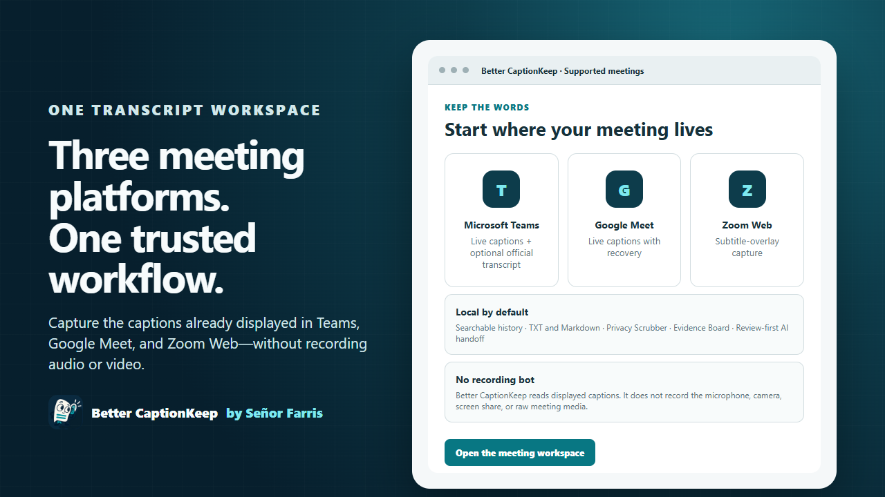
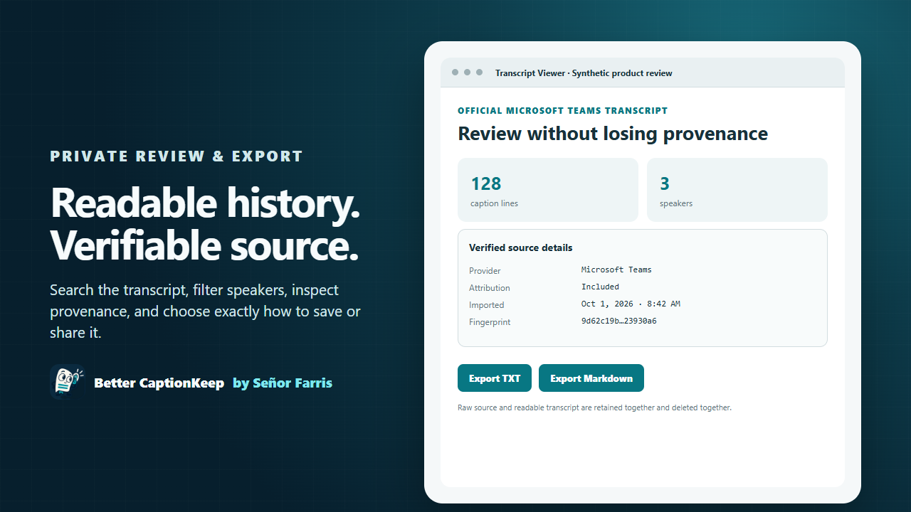

# Better CaptionKeep

**by Señor Farris** — Keep the words. Stay in the conversation.

[Privacy policy](PRIVACY.md) · [Report an issue](https://github.com/Mr-GraphnStaff/better-captionkeep/issues) · [Contributing](CONTRIBUTING.md) · [MIT license](LICENSE)

Save live captions from Microsoft Teams, Google Meet, and Zoom Web in Chrome or Microsoft Edge, including the Teams PWA. Export TXT, Markdown, or Word documents, choose a save location, revisit the durable local completed-meeting archive, and select a synchronized interface theme. Scribble is our listening transcript mascot.

> **Current install status — October 4, 2026:** Chrome Web Store and Microsoft Edge Add-ons are serving `5.1.0`. The public GitHub `v5.3.0` release is frozen historical evidence and is not approved for Store submission or new unpacked installation. The corrected `5.3.1` candidate is tracked in [PR #67](https://github.com/Mr-GraphnStaff/better-captionkeep/pull/67) and must be promoted through the unified Azure Store pipeline after its release gate passes.

### October 3 development additions — not a promoted release

**All Settings** is a prominent full-width control beneath the popup header. It opens every setting in a full browser tab; it is also available through the browser's extension Options action. The transcript viewer has per-export file types, Print / PDF (choose Save as PDF in the browser dialog), and keyboard shortcuts. The AI handoff offers reusable local task templates without retaining transcripts as templates.

**Chat & links** captures a user-requested snapshot of loaded meeting-chat rows from recognized meeting panes. It does not capture the entire Teams chat application, scroll or fetch older messages, or guarantee full chat history. Unsupported layouts fail explicitly; provider selectors need live UAT. Reviewed extras are separate from spoken evidence and are removed with source archive deletion/retention. **Screenshot** captures only the active supported meeting tab, opens a review preview, and requires confirmation before local retention. Images are not automatically scrubbed and are blocked under forced scrubbed-export policy.

**Translate** uses the browser's feature-detected on-device Translator API, supports incremental translation of visible captions while the panel is open, and creates a separate machine-translated derivative. Language packs may need an initial download. Unsupported devices/language pairs show an explicit fallback to the reviewed AI Translate template; no cloud translation is silently substituted.

Better CaptionKeep is one product: every shipped feature is available to every user without payment, activation, subscription, or a feature tier. Organizational security policy, provider authorization, tenant consent, and browser capability requirements still apply. Google Drive/Docs and OneDrive/SharePoint transport adapters have mocked tests; end-user sign-in, provider app configuration, separate consent, preview integration, and live uploads remain unfinished. See [universal feature access](docs/FEATURE-ACCESS.md) and [competitive feature tracking](docs/COMPETITIVE-FEATURES-2026-10-03.md).

The viewer also exports SRT/WebVTT when a newly imported official Teams transcript contains real media cue boundaries. Live browser observation times and older imports without preserved boundaries are rejected rather than assigned invented timing. Use `npm run build:dev` for development and `npm run build:uat` for the one release candidate; ad hoc output folders are intentionally unsupported.

## Better CaptionKeep 5.0

Better CaptionKeep began as a fork of Live-Captions-Saver. Version 5.0 moves decisively beyond that starting point: a privacy-first, enterprise-ready caption workspace designed to support Microsoft Teams, Zoom, and Google Meet through a shared provider architecture.

Version 5.0 combines multi-platform capture with local transcript history, local PII/PHI/PCI-like pattern masking through **Scrubby**, profanity and custom-term filtering, managed enterprise configuration, accessible themes, and reviewable Bring Your Own AI (**BYOAI**) handoffs that do not place transcript text in provider URLs. Teams remains the foundation and Google Meet is a supported live-capture provider. Zoom Web is the next development track; it is not part of the already-published 5.0.0 Store artifact. This is an independent evolution of the original MIT-licensed project, not an upstream endorsement or a claim of regulatory compliance.

## Better CaptionKeep 5.1

The 5.1 release line adds governed Zoom Web support and hardens the shared capture path: Teams interim captions are stabilized before commit, recovery checkpoints are bound to the originating browser tab, Google Meet recognizes same-URL post-call state, live-view payloads expire and refresh from the active session, Scrubby preserves transcript structure, session-history writes are quota-safe, and Store publishing validates immutable release assets before upload. The release record preserves the distinction between completed Store promotion and live-UAT items that were not completed before the product owner's early-promotion decision.

## Better CaptionKeep 5.2 development

The unreleased 5.2 development line adds a security-architect review package, enforceable managed controls for export, clipboard, attendee capture, evidence email, and local retention, plus a hardened Windows enterprise deployment profile. It also adds CodeQL analysis, pinned GitHub Actions, a runtime SBOM, and build provenance attestation. These changes are source candidates only until the 5.2 gate, managed-policy UAT, review, and Store promotion are complete; they are not present in the immutable 5.1.0 Store packages.

## Better CaptionKeep 5.3.1 recovery candidate

The 5.3 line introduces **Verified Teams Transcript**: an optional, tenant-administrator-enabled Microsoft Graph experience that recognizes the active Teams meeting, shows up to five recent eligible Teams meetings, and retrieves a chosen official transcript into the standard viewer and private local history. The original `v5.3.0` GitHub artifact was published before production unpacked identity and local-configuration defects were found. It is retained for audit history, not approved for Store submission. The corrected `5.3.1` candidate preserves fixed Dev, UAT, and local Prod identities and is promoted through the single Azure Store pipeline. See the [5.3.1 release record](docs/RELEASE-5.3.1.md), [historical 5.3.0 record](docs/RELEASE-5.3.md), [enterprise Graph transcript connector record](docs/GRAPH-TRANSCRIPT-CONNECTOR.md), and [Entra app-registration runbook](docs/ENTRA-GRAPH-APP-REGISTRATION.md).

## Zoom Web development

The Zoom discovery branch captures displayed subtitle-overlay text from the exact `app.zoom.us` Web client. It does not capture audio or video, use a meeting bot, connect to Zoom RTMS, support the native desktop client, or grant wildcard access to Zoom vanity domains. The tested overlay does not expose speaker attribution, so its records are explicitly labeled `Unknown speaker`. See the [Zoom Web evidence record](docs/ZOOM-WEB-CHALLENGES.md) and [5.1 release record](docs/RELEASE-5.1.md).

## Interface previews

These synthetic 5.3 product previews replace the obsolete popup and empty-viewer images previously shown here. They contain no customer meeting, tenant, transcript, or account data. They describe the recovery candidate and must not be confused with proof of Store availability.

| Supported meetings | Private review and export |
| --- | --- |
|  |  |

## What it does

- Capture displayed Teams and Google Meet captions and available speaker information; development builds also capture the tested Zoom Web subtitle overlay with explicit `Unknown speaker` attribution.
- Export TXT or Markdown with a choice of save location.
- Automatically archive completed meetings locally, reopen them after browser restart, and use speaker aliases. Search the full retained archive by keyword or phrase with meeting-title, speaker, date, and ordering filters, then jump to the matching source caption. The archive does not silently evict older meetings; explicit user deletion and managed retention remain available.
- Optionally include attendee information or hand a transcript to an AI provider.
- Choose CaptionKeep, Light, Midnight, or Follow system appearance across every extension page.
- Work in a branded transcript viewer with a sticky search, speaker-filter, copy, save, and history toolbar.
- Keep the popup calm with expandable settings sections; everyday capture controls remain visible first.
- Open Teams, Zoom Web, or Google Meet from a compact app row, with separate quick-start actions directly below for Meet now or a new meeting.
- Recover an interrupted Google Meet capture from a recent local checkpoint for the same meeting page, then commit it to local history once the meeting ends.
- See capture health in the popup, including the number of caption lines and how recently the last caption arrived.
- Prepare evidence-backed meeting notes with caption IDs for decisions, actions, risks, and unanswered questions before any optional AI handoff.
- Open a slim Chrome or Edge Evidence Board beside the meeting, search the captured transcript, and mark any caption as a decision, action item, question, risk, follow-up, or important moment. Markers stay local, retain their source caption ID, and export as Markdown or provenance JSON without modifying the raw transcript. A reviewed email action opens the user's mail composer without choosing recipients or sending automatically.
- Export/import user preferences or let administrators enforce selected controls through managed browser policy.
- When enabled by an organization, find the current or five recent Teams meetings and explicitly import an authorized official transcript with a separate raw source and verifiable local provenance.
- In Teams, automatically request live captions, the participant roster, and Microsoft 365 transcription. The popup distinguishes the local browser copy from the official tenant-retained transcript and warns when the user’s Teams role, meeting state, or tenant policy prevents transcription from being verified.

Better CaptionKeep is BYOAI today: it prepares short local instructions plus a complete, coverage-checked Markdown evidence file and bounded numbered copy chunks. You review the selected privacy mode, included/omitted counts, chunk count, and file size before deciding whether anything leaves the extension. Privacy Scrubber is visible and on by default: it masks supported sensitive patterns consistently across the complete handoff, leaves the saved original unchanged, and requires a second confirmation before unmasked material can be copied. Pattern detection reduces accidental disclosure risk but does not guarantee HIPAA, PCI DSS, or other regulatory compliance. For managed ChatGPT or Claude accounts, first open the approved enterprise workspace and copy its URL into **Settings → Enterprise destinations**. Better CaptionKeep accepts only official HTTPS provider domains, never places transcript text in a provider URL, and asks you to confirm the active workspace before attaching or pasting. Preferences, including enterprise destinations and the selected theme, may use browser sync; see the [privacy policy](PRIVACY.md) for the full data-handling details.

## Themes

Open the extension popup and select **Settings → Appearance → Theme**. The selection applies immediately to the popup, transcript viewer, export page, and AI handoff page. CaptionKeep preserves the original cream-and-teal appearance; Follow system responds to the operating-system light or dark preference.

Choose **Automatically** to save transcripts without opening a Better CaptionKeep save page, or **Ask me each time** to choose a different location for every transcript. Advanced download settings can remember a dedicated local folder where the browser permits it, configure a subfolder beneath Downloads, open Downloads, and recover pending exports.

## Install for local testing

Version 5.1.0 is the currently verified public Store version in both Chrome and Edge. GitHub `v5.3.0` exists but is not approved for installation or Store submission after post-release defects were found. Use the [wiki installation page](https://github.com/Mr-GraphnStaff/better-captionkeep/wiki/Installation) for ordinary installation; the instructions below are for controlled local testing only.

### Three lifecycle environments

Generated output has exactly three stable locations:

- `dist/dev` — current development build.
- `dist/uat` — the single QA/UAT release candidate loaded unpacked in Chrome or Edge.
- `dist/prod` — directly loadable production build plus Store packages, deployment bundles, hashes, and provenance.

Run `npm run build:targets` to refresh all three directly loadable roots without creating browser-specific, timestamped, feature-review, or frozen copies. Dev, UAT, and local Prod each have a separate stable extension identity and local storage. Rebuilding or upgrading a lane does not change its Microsoft redirect URI and does not overwrite a Store installation. Store installations retain the stable identity assigned by their Store.

The Verified Teams Transcript controls use the same unpacked-only local Graph configuration in Dev, UAT, and Prod for controlled testing. It is not a license or feature gate, and configured Microsoft identifiers are excluded from source and release ZIPs. See the [local Graph runbook](docs/DEV-UAT-GRAPH.md).

For Chrome, open `chrome://extensions`; for Edge, open `edge://extensions`. Enable Developer mode, choose **Load unpacked**, and select `dist/uat`. This is the only supported release-candidate path.

To inspect the promoted production build locally, choose **Load unpacked** and select `dist/prod`. The production root has its own `manifest.json`; ZIPs and deployment evidence in that same lane are ignored by Chromium when it loads the extension.

1. Open Microsoft Edge and visit `edge://extensions`.
2. Enable Developer mode.
3. Choose **Load unpacked** and select `dist/uat`.
4. Open Microsoft Teams in Edge and enable live captions during a meeting.

After the project folder move, reload the extension from its new location if needed.

## Development

Use Node.js 20 or newer, then run `npm install`.

- `npm run lint`: validate the extension manifest and assets.
- `npm run build`: build the Edge Store ZIP in `dist/prod/`.
- `npm run build:dev`: refresh only `dist/dev`.
- `npm run build:uat`: refresh only `dist/uat`.
- `npm run build:prod`: refresh only the directly loadable `dist/prod` root (and clear older production artifacts).
- `npm run build:intune`: generate the Edge force-install and managed-policy bundle in `dist/prod/intune-edge/`.
- `npm run build:intune:chrome`: after the Chrome Store assigns an extension ID, generate the Chrome force-install and managed-policy bundle in `dist/prod/intune-chrome/`.
- `npm run build:intune:local-only`: generate the optional high-security bundle that disables AI handoff.
- `npm run build:chrome-store`: generate and verify the production-labeled Chrome Web Store package in `dist/prod/`.
- Test capture, TXT/Markdown export, Save As, saved sessions, and Teams PWA behavior in Edge before publication. Zoom development also requires unpacked Chrome and Edge UAT against the Web client.

Release and enterprise references: [standalone product record](docs/PROJECT-EMERGENCE.md), [5.1 release notes](docs/RELEASE-NOTES-5.1.md), [security architecture and threat model](docs/SECURITY-ARCHITECTURE.md), [security and privacy design](docs/SECURITY-PRIVACY.md), [EUC deployment](docs/EUC-DEPLOYMENT.md), [enterprise security review record](docs/ENTERPRISE-SECURITY-REVIEW.md), [5.2 development gate](docs/RELEASE-5.2.md), [5.3.1 release-candidate record](docs/RELEASE-5.3.1.md), [withdrawn 5.3.0 record](docs/RELEASE-5.3.md), [Dev/UAT/Prod Graph runbook](docs/DEV-UAT-GRAPH.md), [enterprise Graph transcript connector record](docs/GRAPH-TRANSCRIPT-CONNECTOR.md), [Entra app-registration runbook](docs/ENTRA-GRAPH-APP-REGISTRATION.md), [platform adapter boundary](docs/PLATFORM-ADAPTERS.md), the completed [5.1 release record](docs/RELEASE-5.1.md), [Edge publishing pipeline](docs/EDGE-PUBLISH-PIPELINE.md), and [Chrome publishing pipeline](docs/CHROME-PUBLISH-PIPELINE.md).

Browser API identifiers such as `chrome.storage` remain unchanged because Edge implements those Chromium extension APIs. Internal source paths remain stable.

## Publication status

Target stores: **Microsoft Edge Add-ons and the Chrome Web Store**. Version 4.7 was retired from publication. Version 5.0 established the fully independent product line, and 5.1 is the latest promoted line. The [privacy policy](PRIVACY.md) is published. Repository release status does not imply certification or approval by either store; use the release record for per-Store evidence. Chrome submission preparation is tracked in the [Chrome Web Store checklist](docs/CHROME-WEB-STORE-SUBMISSION.md).

Production changes reach `master` only through review and validation. See the [contribution guide](CONTRIBUTING.md) and [release process](docs/RELEASE_PROCESS.md).

## Attribution and license

Better CaptionKeep originated from [Live-Captions-Saver](https://github.com/Zerg00s/Live-Captions-Saver) by Denis Molodtsov and is now independently developed as its own product and GitHub repository. The original MIT license, copyright, and permission notices remain preserved in LICENSE and in the packaged extension.

Not affiliated with or endorsed by Microsoft.
